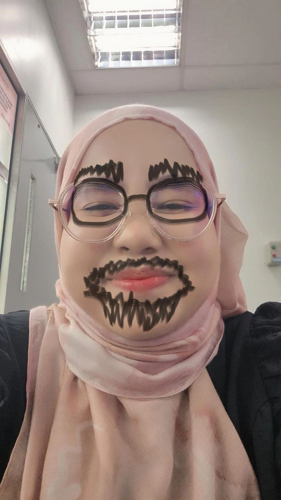

<!DOCTYPE html>
<html lang="ms">
<head>
    <meta charset="UTF-8">
    <meta name="viewport" content="width=device-width, initial-scale=1.0">
    <title>Mood Booster</title>
    
</head>
<body>
    

        <h1>Hi B (B for Brader)</h1>
        <!-- Gantikan 'my_image.png' dengan pautan gambar anda -->
        
        
        

            
Kesihatan

        

        
        
Hai Anep!

        

            <button onclick="feedPet()">Beri Makan 🍔</button>
            <button onclick="petPet()">Pujuk 🤗</button>
            <button onclick="sendKiss()">Send Kiss 😘</button>
        

    

</body>
</html>
